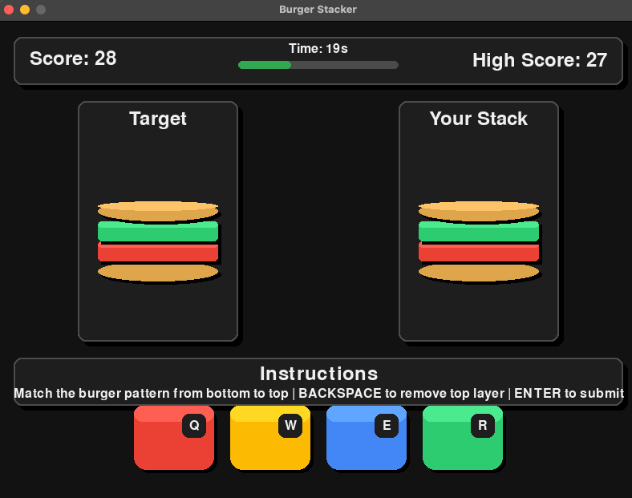

# Burger Stacker Game built with Amazon Q Developer

# 1. Introduction

Exploratory repo that uses Amazon Q Developer CLI to generate a PyGame for a Burger Stacker Game based on a series of prompts used. This repo elaborates on Q Developer CLI, the prompts used, and how to play the game.

# 2. Pre-reqs

Install Amazon Q Developer CLI. Installation steps detailed here: [Amazon Q Developer User Guide: Installing Amazon Q for command line](https://docs.aws.amazon.com/amazonq/latest/qdeveloper-ug/command-line-installing.html)

# 3. Prompting

Refer to [prompt-sequence.md](./prompt-sequence.md) for each step of prompt refinement.

# 4. Game files

Amazon Q Developer generated the following files

- [burger_stacker.py](./q-generated-files/burger_stacker.py)
- [README.md](./q-generated-files/README.md)
- [requirements.txt](./q-generated-files/requirements.txt)

# 5. Running the game

Follow the installation instructions in [q-generated-files/README.md](./q-generated-files/README.md) to install the relevant packages and run the game

# 6. Game UI

