# Prompt sequence

# 1. Start Q CLI

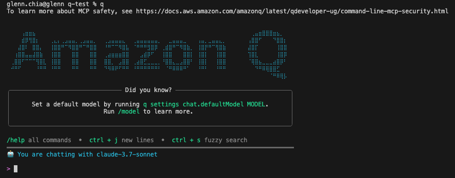

# 2. First prompt

Enter the following prompt. Q Developer transitions to `Thinking...`

```
# Burger Stacker Game - PyGame Implementation

## Project Overview
Create a complete PyGame implementation of a color-matching memory game called "Burger Stacker" where players recreate color patterns from bottom to top within a time limit.

## Core Game Mechanics
1. Display exactly 1 stack (burger) on screen at a time
2. Each stack contains 1-5 colored layers randomly selected from: red, yellow, blue, green
3. Players must match the color pattern via keyboard input, building from bottom to top
4. Only after successfully matching the current stack will a new stack appear
5. 60-second time limit per game session
6. High score persistence across sessions

## Detailed Requirements

### Game Display
- Clear visual representation of a single colored stack (burger-like appearance)
- Current score display
- Remaining time countdown (60 seconds)
- High score display
- Visual feedback for player inputs
- Game state indicators (playing, game over)
- **Arcade-style buttons displaying each color with corresponding key letter overlay**
  * Red button with "Q" label
  * Yellow button with "W" label
  * Blue button with "E" label
  * Green button with "R" label
- Visual representation of the player's current build progress

### Player Controls
- Color input keys:
  * Q = Red
  * W = Yellow
  * E = Blue
  * R = Green
- ENTER key to submit pattern
- BACKSPACE to remove only the top color from the current input stack

### Game Logic
- Generate one random color stack with 1-5 layers
- Each layer must be one of the four possible colors: red, yellow, blue, or green
- Track player input sequence as they build their burger from bottom to top
- Compare player sequence with target sequence
- Award points for exact matches only (stack height = points earned)
- No partial points - player must complete pattern exactly
- Allow correction via BACKSPACE to remove the topmost layer only
- Generate a new stack only after player successfully matches current stack
- End game when timer reaches zero
- Discard incomplete patterns when time expires

### Score System
- Points awarded = number of layers in correctly matched stack
- Store and display high score across sessions
- Show final score when game ends

## Technical Requirements
- Implement using PyGame library
- Include comments explaining key functionality
- Structure code with proper OOP principles
- Handle all input validation and edge cases
- Implement persistent storage for high scores

## Additional Deliverables
1. A `requirements.txt` file that lists all necessary Python packages (including pygame and any other dependencies)
2. A detailed `README.md` with:
   - Project title and description
   - Installation instructions (how to install required packages using pip/requirements.txt)
   - How to run the game (command line instructions)
   - Game controls explanation
   - Game rules summary
   - Any system requirements or dependencies

## Output Format
Please provide the following files:
1. `burger_stacker.py` - Main game implementation
2. `requirements.txt` - Package dependencies list
3. `README.md` - Installation and usage instructions

All code should be well-commented and ready to run with minimal setup on standard Python installations.
```

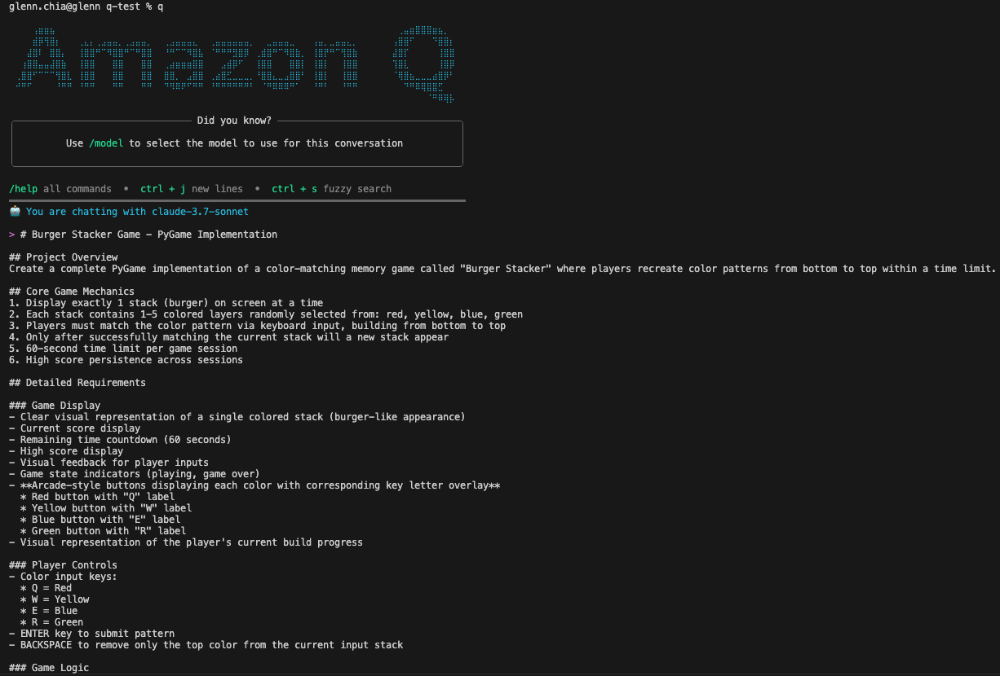

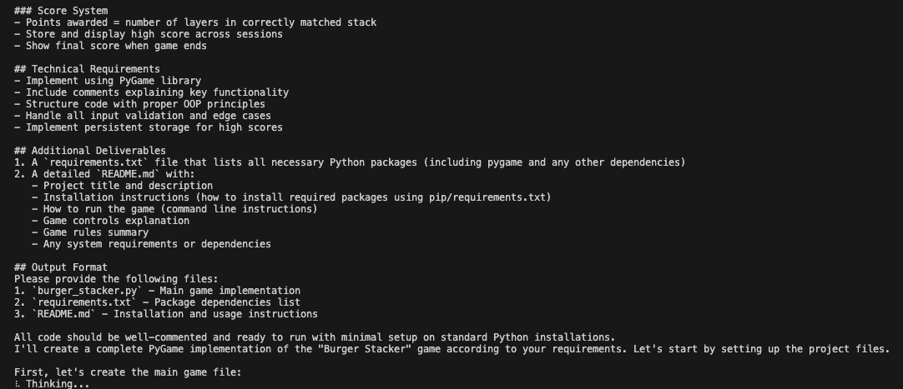

Once done, Q generates a file and asks the user for permission to write the file

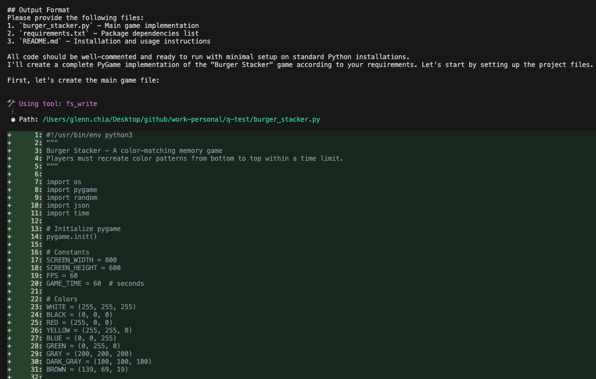

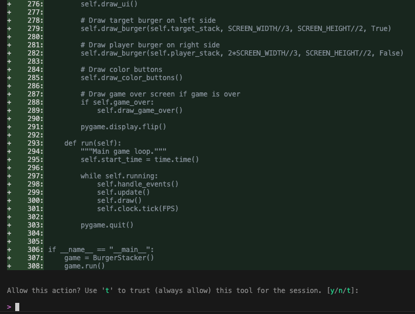

Verify that the file is created

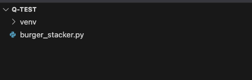

Sometimes Q Developer might detect a mistake and ask for permission to make a fix

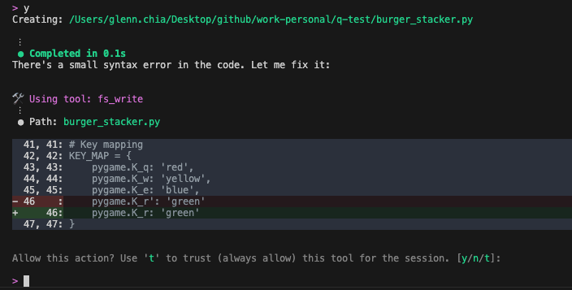

It then generates a `requirements.txt` file

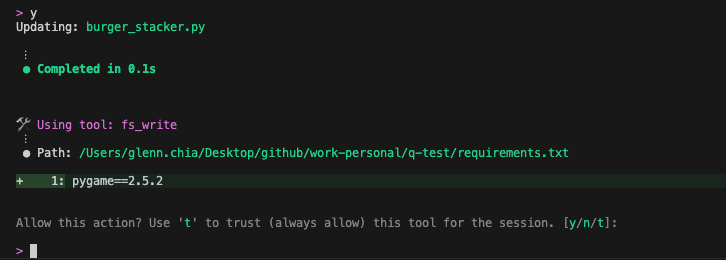

It also generates a `README.md` file

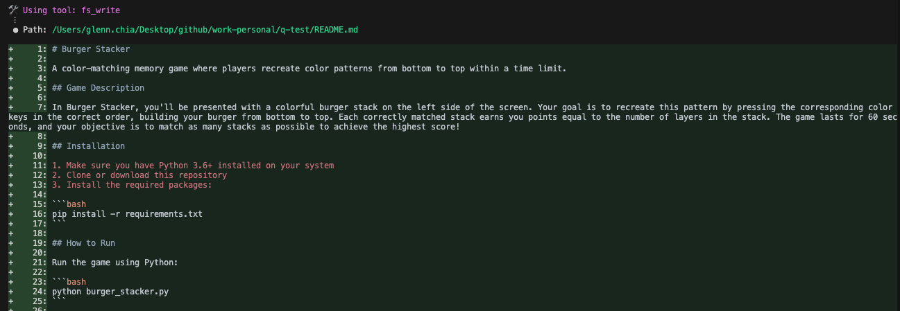

Finally Q Developer gives a completion summary

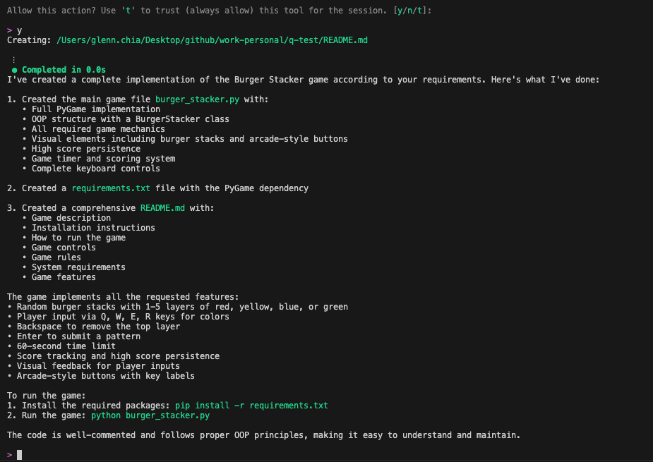

Resulting UI at this stage after running the game

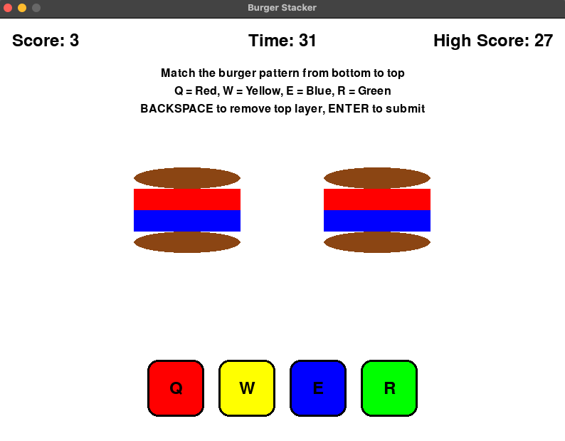

# 3. Second prompt

Use the following prompt as a base to modify the UI. It is possible to be more specific than this (e.g. specifying specific colors or descriptions of the button design etc.). Even though the prompt is not as structured as the first prompt used, it still achieved the desired effect.

```
Change the UI to dark theme and make the UI more futuristic with an arcade theme.
```

Q Developer then proceeds to modify the files to achieve the desired effect.

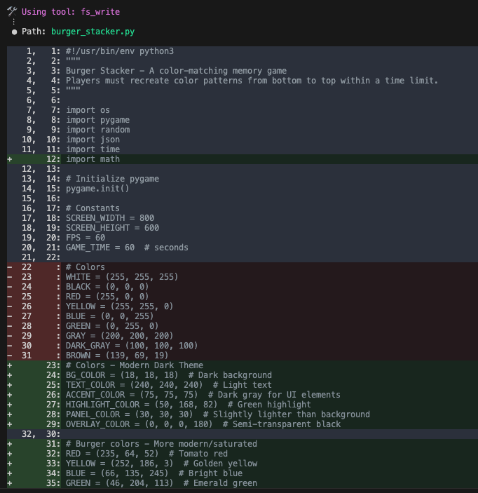

Accept the code change

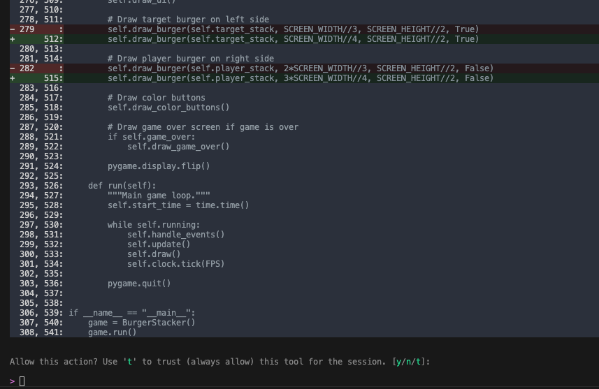

View the new UI. While there are improvements, the instructions overlap, making it hard to read. There were also some UI behaviors with animating the burger that slowed down the game play (when the pattern was submitted, the matching burger would shake)

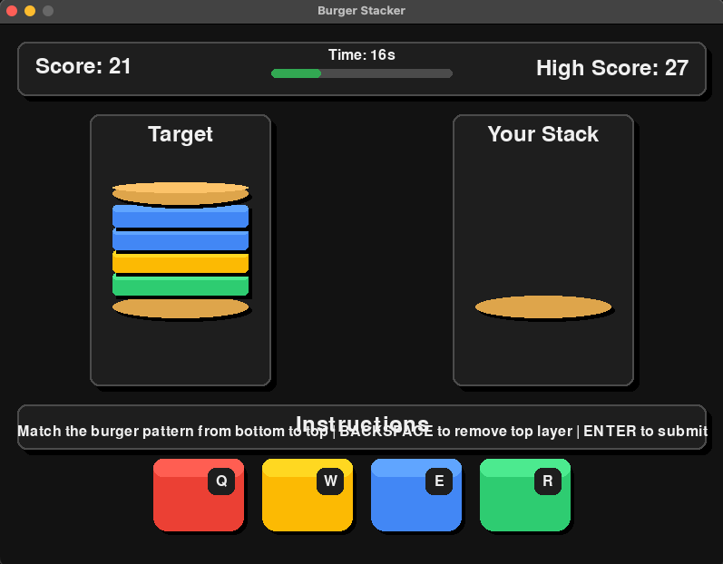

# 4. Third and final prompt

To remedy this, use this prompt as a base. Even though the prompt is not as structured as the first prompt used, it still achieved the desired effect.

```
The text for the word Instructions and the actual instructions overlap. This should be fixed. Also, after submitting, I don't want the burger to shake. Instead, just display the next burger. I want the pace of the game to be fast
```

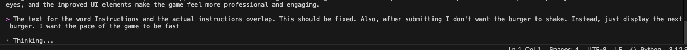

Q Developer makes several changes to the files (Option to approve the changes as they come or approve them all)

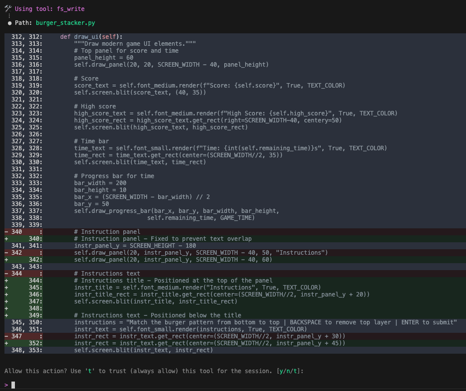

Once completed, there is a completion summary

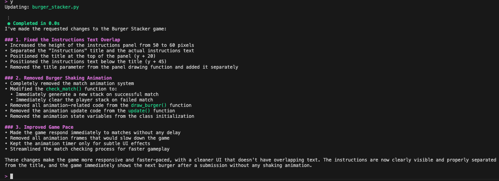

Final UI for the in-game play and the game over screen

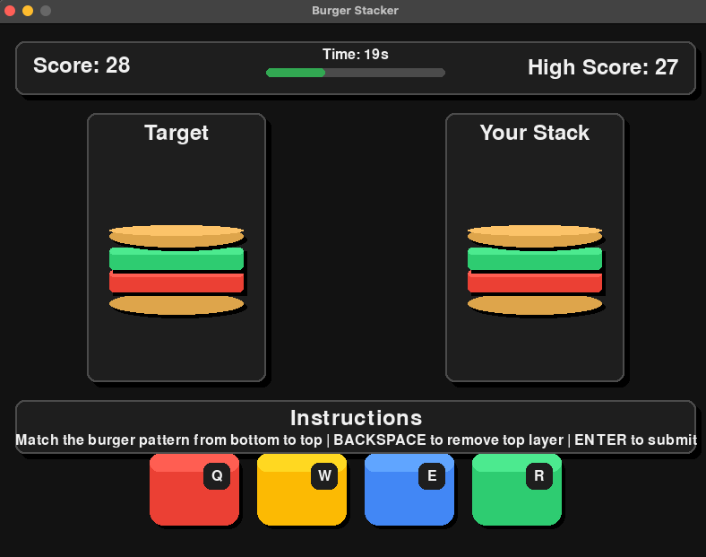

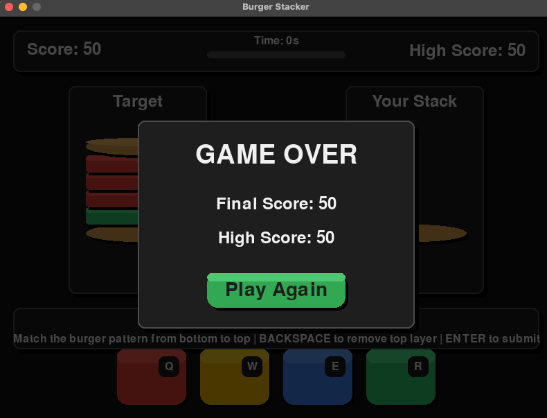